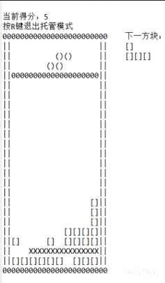
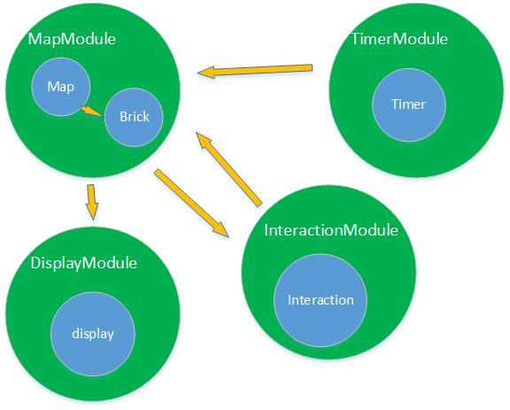
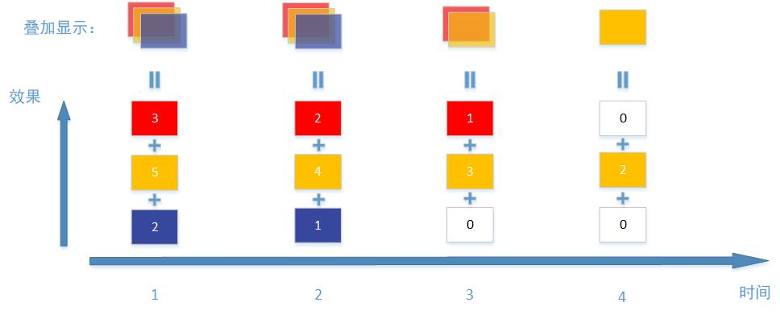

# Tetris-AI-Java
此乃Java课大作业，作者实现了一个同步通信多线程的俄罗斯方块，可手玩也可自动玩。

## 效果
以下展示的是自动模式，用`Eclipse IDE`控制台显示游戏画面（没有制作精美的画面只有简陋的动画效果）。当然除了自动模式也可以动手玩。

## 运行
编译Tetris/src/tetris/Game.java然后运行。

## 如何实现
### 框架
我们把整个游戏的构成抽象成以下几个概念：
* `方块`（Brick）

  可以在无穷大二维空间中运动（平移或90度旋转）的一些由像素点构成的图形。
* `地图`（Map）
  
  有限大小的像素点矩形区域，用来规定`方块`的运动范围与生存周期，以及计算这一区域内的拓扑性质（如判断方块是否满行）。
* `定时器`（Timer）

  用来将游戏的进行步骤以最小时间节拍离散化的部分。
* `显示`（Display）
  
  用来在显示设备上显示地图状态的部分。
* `交互`（Interaction）

  用来与游戏内核交流（如监听键盘事件以控制方块移动）的部分。

我们完全可以使用以上这些基本元素组成一个完整的俄罗斯方块游戏，在一个线程之内便可运行。而作进一步思考可以发现，这些元素间是具有某些连通关系的，比如`地图`需要给`显示`传送像素点的分布信息，而`显示`却不需要给`地图`传递任何东西。这些关系可以简单地用一个图的数据结构来表达。

可以看到，Module是图的顶点，为通信的实体；各边表示顶点间的连通，为接收数据的消息队列。整个程序框架分为两层，绿色的圆代表通信层，蓝色的圆代表基本元素层。一个Module是一个线程，它管理基本元素，线程间又以消息队列的方式通信，所以基本元素层间交互依赖通信层的交互，向上提供数据给通信层。此时`定时器`不仅可以驱使`方块`向下运动的触发器，还可以用来控制消息队列的定时接收。

在此种框架下，线程可以扩展为进程，也即是开启多个Java程序运行一个俄罗斯方块。当然，你也可以将代码移植到不同的设备上，使得一局俄罗斯方块可以在不同的设备上运行。

### 核心逻辑
* `定时器`负责定时产生给`方块`向下移动的命令。
* `交互`从外设中获取`方块`的运动命令。
* `地图`检查`方块`运动的有效性（是否触边），同时检查`方块`是否应该停止与一行是否已被填满。
* `显示`将地图状态显示出来。

### 接口
#### Display
在游戏核心控制的`显示`中，作者还实现了一些小动画效果，比如在方块停止后的渐变效果，消除满行的清除效果等，并且这些效果是“并行”显示的。作者采用的策略是，把效果分为不同的种类，每种效果又分成多个步骤，在显示线程中使用定时器生成一个最小的时间节拍，每个时间节拍显示一个步骤，该步骤由多种效果叠加生成。这样可以实现“并行”的显示效果。

作者并没有制作出精美的GUI，而是留出了其外部接口供实现。可以通过继承核心控制中的`Display`类的绘制方法，自行实现想要的画面。如，`ConsoleDisplay`继承自`Display`，实现在控制台绘制游戏画面。

#### Interaction
交互可以是一个普遍的概念，比如玩家通过键盘输入控制方块移动，或者用手机触屏输入，甚至机器本身可以产生策略输入。因此，此部分应该设计为一个接口。<!-但是事实上接口部分写得很烂。->作者不仅实现了键盘输入版本的交互，还实现了机器输入版本，即AI给出操作方块的策略。

AI算法采用[Deep Reinforcement Learning](https://github.com/nuno-faria/tetris-ai) ，通过移植Keras训练出的模型到Java端实现。最高可以玩到500分，再继续训练下去花的时间太长了。

## 文件目录
    Tetris
    └─src
        │  module-info.java
        │  
        ├─agent 
        │      Agent.java               
        │      Mat.java
        │      NN.java                 
        │      Weights.java       
        │      
        ├─core
        │  ├─brick
        │  │      BasicBrick.java
        │  │      BrickInMap.java
        │  │      
        │  ├─data_structure
        │  │      Dict.java
        │  │      Graph.java
        │  │      List.java
        │  │      Queue.java
        │  │      
        │  ├─display
        │  │      Display.java
        │  │      
        │  ├─graph
        │  │      TetrisGraph.java
        │  │      
        │  ├─interaction
        │  │      Interaction.java
        │  │      
        │  ├─map
        │  │      Map.java
        │  │      Point.java
        │  │      Row.java
        │  │      Rows.java
        │  │      
        │  ├─message
        │  │      Message.java
        │  │      
        │  ├─modules
        │  │  │  MdlMsg.java
        │  │  │  Module.java
        │  │  │  
        │  │  ├─brick
        │  │  │      BrickModule.java
        │  │  │      
        │  │  ├─disp
        │  │  │      DispMessage.java
        │  │  │      DispModule.java
        │  │  │      
        │  │  ├─interation
        │  │  │      InterMessage.java
        │  │  │      InterModule.java
        │  │  │      
        │  │  ├─map
        │  │  │      MapMessage.java
        │  │  │      MapModule.java
        │  │  │      
        │  │  └─timer
        │  │          TimerModule.java
        │  │          
        │  └─timer
        │          Timer.java
        │          
        ├─display
        │      ConsoleDisplay.java
        │      
        ├─keyboard
        │      KeyBrickEvent.java
        │      KeyEventListener.java
        │      
        └─tetris
                Game.java

## 关于作者
虽然作者很菜，但是如果你对项目有什么意见，发现bug或者想要交流技术，随时欢迎联系，或许作者会给你改改bug也说不定。

* 邮箱 837706620@qq.com
